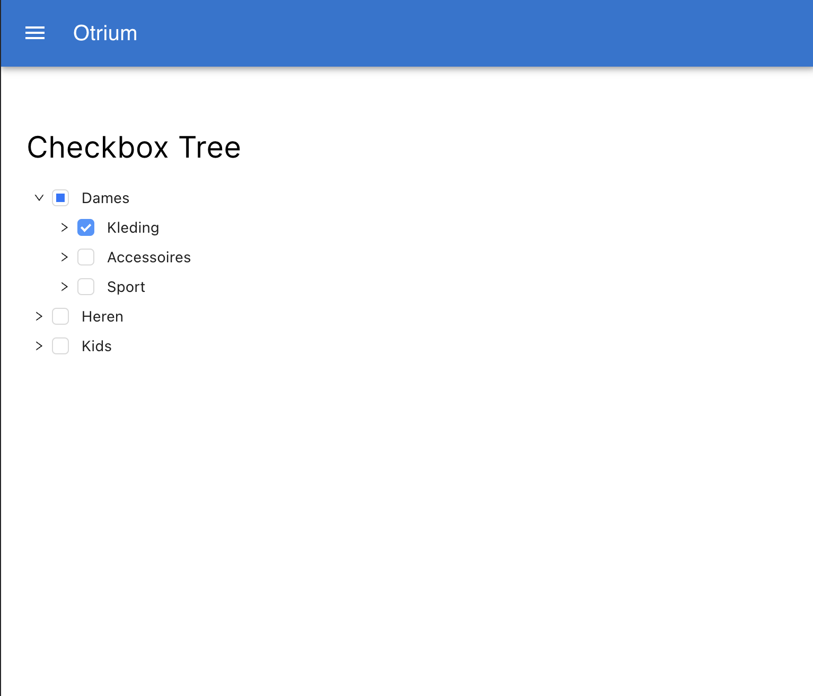

## Solution to Otrium front-end challenge by Babatunde Adeniran

To start the app, cd into the project directory and
### `npm start` or `npm run start`

To run the tests
### `npm test` or `npm run test`

To check the test coverage level
### `npm run coverage`

### What i have done
1 - I split my code into different connecting files, components, and folders. 

2 - I have built a ui tree of checkboxes to represent the tree of categories based on the data provided.

3 - I have modified the code to show initially only the parent category checkboxes. I also ensured user can toggle to view children categories or sub-categories.

4 - I ensure users can view selected categories. 

It is important to note that if all the children of a parent category are selected, a checkmark is shown in the checkbox. However, if only a subset of children are selected, a square box will be seen in the checkbox. 

5 - I have also made sure users can remove selected categories and remove-all selected categories.

If you tick or untick the checkbox of a parent element, all its children will be selected or unselected accordingly. To select only preferred children categories, first expand the parent and select the children category you prefer.

6 - I have made sure for every child category, you can either select or unselect all it subtrees and the explanation from point number 4 applies here too. 

7 - I ensured the final outcome is responsive across different screen sizes.

### Technologies and libraries used
1 - React.js
2 - Typescipt
3 - Material UI - https://mui.com/material-ui/getting-started/
4 - AntD - https://ant.design/

### Current test coverage report

### My next move
I will create a build for the app and deploy it. The hosted URL will be sent together with the GitHub repository for the assessment. 